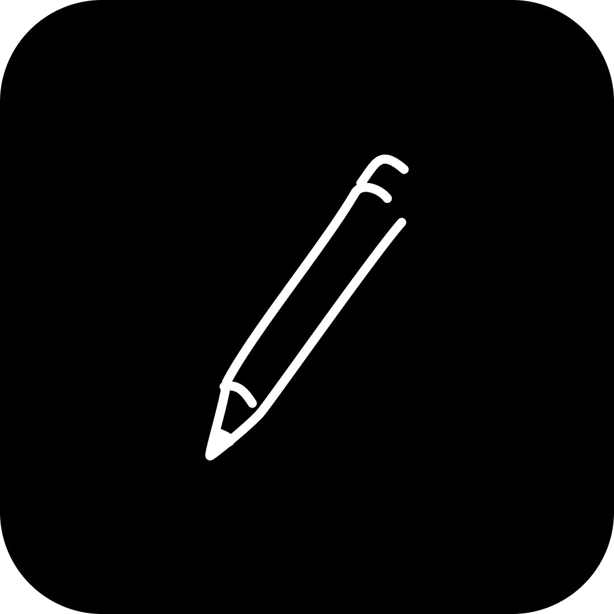
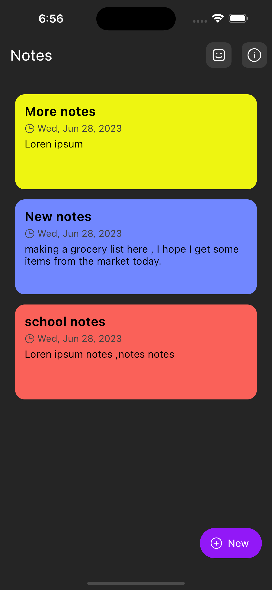
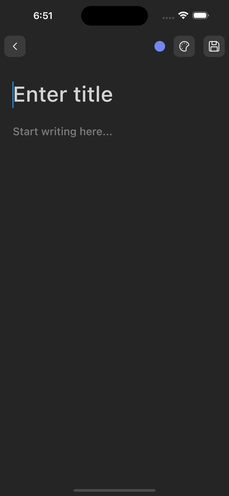
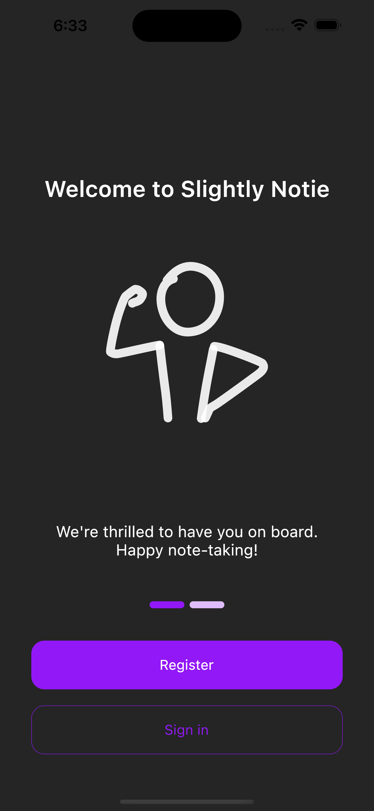
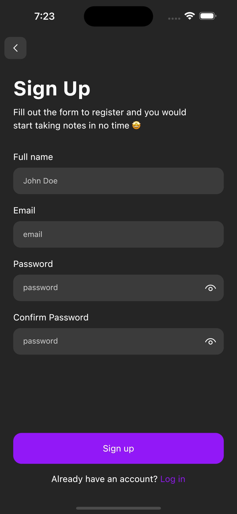
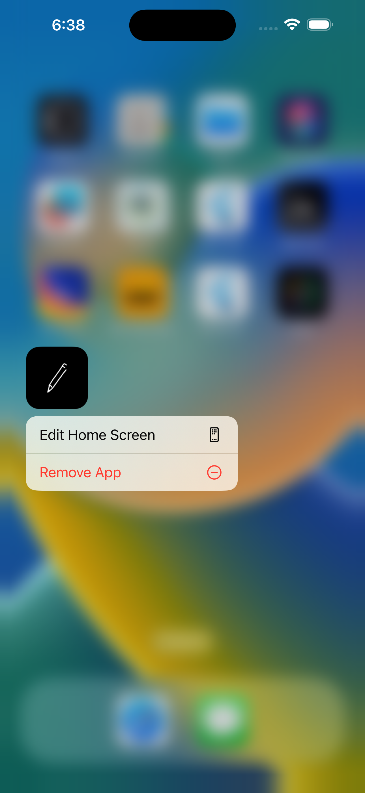
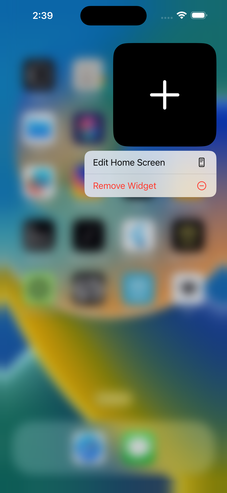

# slightly_notie

A simple note taking app with flutter and firebase .

*My solution to the Slightly Techie Challenge*

#### Showcase
| Homepage | | Add notes Page |
| :---: | --- | :---: |
|  ||  |
| Simple homepage layout that lists   notes created by user || Adding a new note   it asks for title and notes |

| Onboard | | Sign Up |
| :---: | --- | :---: |
|  ||  |
| Simple onboarding page to   tell you about the app|| Simple sign Up page for    user authentication |

| Preview | | IOS widget |
| :---: | --- | :---: |
|  ||  |
| A little preview on IOS 😊|| IOS widget to add notes from homescreen     |

#### Video Demo
Click [here](https://drive.google.com/file/d/16fr7tW1zjWig9TFfHdgnQqjpaLDqV6kb/view?usp=sharing) to watch a video demo of Slighlty Notie App in acton.
__*Please adjust the resolution if the video looks blurry*__

#### Download the APK
- [Slightly Notie Apk](https://drive.google.com/file/d/10CThsevS2m7QxHOVo-UXwCQtyQ7SshaM/view?usp=drive_link)

#### Framework
Slightly Notie is built with the **Flutter SDK** in the **Dart** programming language. This allows Slightly Notie to be deployed on multiple platforms with the same codebase and minimal platform setup.

#### Backend
The app is powered by firebase , from authentication to data storage.

#### Illustrations

Most of the illustrations are from a website i discovered (https://www.thedoodlelibrary.com/) .

#### UI/UX

Took some inspiration from pinterest but basically built out the ui all by myself 😌 .

##### P.S.
Feel free to clone and mess around. Pull requests are welcome. There's a lot of data from the backend that isn't being used as per the requirements of the challenge but they can make the app's UI richer.

A new Flutter project.

## Getting Started

This project is a starting point for a Flutter application.

A few resources to get you started if this is your first Flutter project:

- [Lab: Write your first Flutter app](https://docs.flutter.dev/get-started/codelab)
- [Cookbook: Useful Flutter samples](https://docs.flutter.dev/cookbook)

For help getting started with Flutter development, view the
[online documentation](https://docs.flutter.dev/), which offers tutorials,
samples, guidance on mobile development, and a full API reference.

